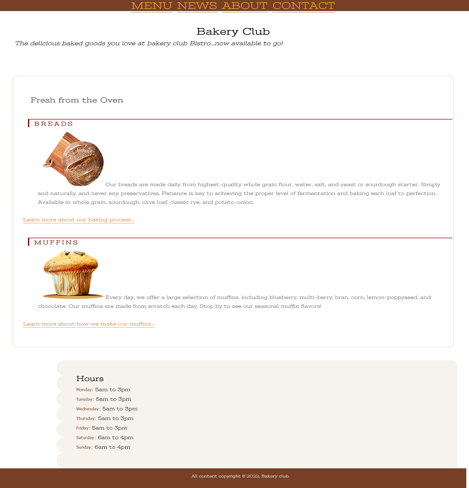

# BakeryClub

## Table of contents

- [Overview](#overview)
  - [The challenge](#the-challenge)
  - [Links](#links)
- [My process](#my-process)
  - [Built with](#built-with)
  - [What I learned](#what-i-learned)
  - [Continued development](#continued-development)
  - [Useful resources](#useful-resources)
- [Author](#author)

## Overview

### The challenge
A small bakery ask me to create a mini presentaion page. 

### Links

- Solution URL: (https://github.com/stathislag/bakeryClub)
- Live Site URL: (https://stathislag.github.io/bakeryClub/)

## My process

### Built with

- HTML5 
- CSS 
- Flexbox

### What I learned

Some of my major learnings while working through this project. Was stracture my project in Html,Css learn new properties around css like margin, classes, ids, padding and much more. 
New consepts in css how to write Media Queries.

### Continued development

In future projects i would like to learn more consepts about Css Framework like Bootstrap 5 and try out new techniques.

### Useful resources
This helped me with the building process and answered all my questions:
- [Resource 1](https://developer.mozilla.org/).
- [Resource 2](https://www.w3schools.com/).
- [Resource 3](https://www.youtube.com).
- [Resource 4](https://www.stackoverflow.com).

## Author

- Website - [Stathis](https://github.com/stathislag)

